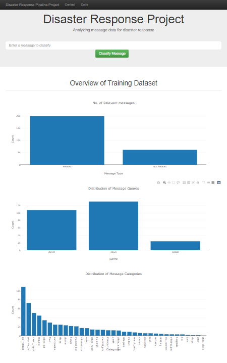

# Disaster Response Pipeline

## Requirements
I have used Python 3.7.6 for this project. The libraries used for are: 
- numpy == 1.12.1
- pandas == 0.23.3
- plotly == 2.0.15
- scikit-learn == 0.19.1
- nltk == 3.2.5
- Flask == 0.12.4
- gunicorn == 19.9.0
- SQLAlchemy == 1.2.18
- jsonschema == 2.6.0
Further details can be found in the requirements.txt file

## 2. Project Motivation

 In this project, disaster response data from Figure Eight has been analysed to build a model for an API that classifies disaster messages. The data set provided by Figure Eight contains real messages that were sent during disasters.

I have created an ML pipeline to categorize these messages  in order to send them to the appropriate disaster relief agency. 
The data has been split into a training set and a test set, post which an ML pipeline utilizing NLTK and Scikit Learn is used to output a final model. Finally

A web app built using Flask and Bootstrap is the final output of the project. Through the app, a Disaster Relief agency can input a message to categorize. The output also shows visualisations of the data. 

The web app also displays visualizations of the data as follows:

## 4. Instructions:
	1. Run the following commands in the project's root directory to set up your database and model.

    	- To run ETL pipeline that cleans data and stores in database
        `python data/process_data.py data/disaster_messages.csv data/disaster_categories.csv data/DisasterResponse.db`
    	
    	- To run ML pipeline that trains classifier and saves
        `python models/train_classifier.py data/DisasterResponse.db models/classifier.pkl`

	2. Run the following command in the app's directory to run your web app.
    `python run.py`

	3. Go to http://0.0.0.0:3001/

